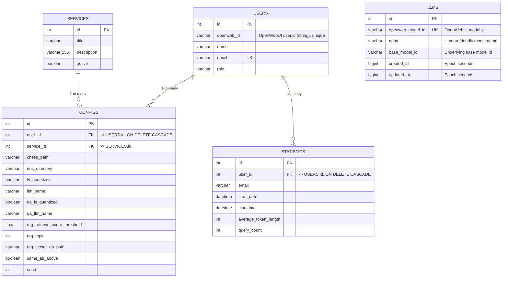

# OpenSI-CoSMIC - Cognitive System of Machine Intelligent Computing

[](https://opensource.org/licenses/MIT)
[](https://arxiv.org/abs/2408.04910)
[](https://www.python.org)
[](https://www.canberra.edu.au/about-uc/media/newsroom/2024/november/ucs-opensi-researchers-develop-framework-to-integrate-and-interpret-ai-tools)
[](https://www.docker.com/)

This is the official implementation of the Open Source Institute-Cognitive System of Machine Intelligent Computing (OpenSI-CoSMIC) v1.0.0.

## Installation

### Pre-requirements

Before proceeding with the installation, ensure that the following tools are installed on your local machine:

1. **Docker**: Required for containerized environments. You can install it by following the [official Docker installation guide](https://docs.docker.com/get-docker/).

2. **Docker Compose**: Facilitates defining and running multi-container Docker applications. You can install it by following the [official Docker Compose installation guide](https://docs.docker.com/compose/install/).

### Option 1: Docker Installation (Quick Start)

The Docker installation provides the fastest way to get started with OpenSI-CoSMIC:

1. Download the `docker-compose.yaml` file from the official CoSMIC GitHub repository:

```bash
wget https://github.com/TheOpenSI/CoSMIC/raw/production/docker-compose.yaml
```
2. **Important**: If you're running on a machine without an NVIDIA GPU or CUDA support, you need to modify the `docker-compose.yaml` file. Open the file and comment out the GPU resource allocation section:
```yaml
# Comment out these lines if you don't have an NVIDIA GPU
 deploy:
   resources:
     reservations:
       devices:
         - driver: nvidia
           count: all
           capabilities: [gpu]
```


3. Open the directory containing the `docker-compose.yaml` file in a terminal and run the following command to start the services:

```bash
docker compose up -d
```

### Option 2: Clone and Set Up Repository (For Development)

1. Install Git on your local machine if it is not already installed. You can follow the [official Git installation guide](https://git-scm.com/book/en/v2/Getting-Started-Installing-Git).

2. Clone the CoSMIC repository in your work directory:
```bash
# For users using SSH on GitHub
git clone git@github.com:TheOpenSI/CoSMIC.git

# For users using HTTPS
git clone https://github.com:TheOpenSI/CoSMIC.git
```

3. Clone the Open-WebUI repository in your work directory:
```bash
# For users using SSH on GitHub
git clone git@github.com:TheOpenSI/OpenWebUI-CoSMIC.git

# For users using HTTPS
git clone https://github.com:TheOpenSI/OpenWebUI-CoSMIC.git
```

**Note**: Ensure that both repositories are cloned into the same directory to maintain compatibility.

4. **Important**: If you're running on a machine without an NVIDIA GPU or CUDA support, you need to modify the `docker-compose.yaml` file. Open the file and comment out the GPU resource allocation section:
```yaml
# Comment out these lines if you don't have an NVIDIA GPU
 deploy:
   resources:
     reservations:
       devices:
         - driver: nvidia
           count: all
           capabilities: [gpu]
```

5. Navigate to the CoSMIC repository directory and start the services using Docker Compose:
```bash
cd CoSMIC
```

6. Now you can build from your local clone using the command below:
```bash
docker compose up -d --build
```

7. **Important**: During the first run, the system will automatically download the Llama3.1 model, which may take some time depending on your internet connection. You can monitor the progress by checking the Docker logs:
```bash
docker compose logs -f cosmic
```
Wait until you see the message: `cosmic | Model Llama3.1 is available in the Ollama container.` before attempting to use the application.

The application will initialize on port 8080. To access it, open a web browser and navigate to `http://localhost:8080`.

## OAuth Implementation
You can integrate OAuth authentication into this application to enhance security and manage user access. For detailed instructions on setting up OAuth, please refer to our [OAuth guide](OAuth.md).

## Postgres Implementation

By default, OpenSI-CoSMIC uses SQLite as its database. However, if you prefer to use Postgres for enhanced scalability and performance, you can configure it by following these steps:

1. Open the `.env` file in the root directory of the project and set the following variables:
  - `DATABASE_USER`: Specify the username for the Postgres database.
  - `DATABASE_PASSWORD`: Specify the password for the Postgres database.
  - `PGADMIN_USER`: Specify the username for PGAdmin.
  - `PGADMIN_PASSWORD`: Specify the password for PGAdmin.

2. Once the `.env` file is configured, run the following command to start the services with Postgres:
```bash
docker compose -f docker-compose.postgres.yaml up -d
```

This will initialize the application with Postgres as the database backend.

**Note**: Configuring the `.env` file is mandatory for the Postgres setup to work correctly. Ensure all variables are properly set before starting the services.

### (New) Separate Cosmic Application Database

The `cosmic` service can now use its own dedicated Postgres database (separate from `openwebui_db`) for internal tables (`users`, `services`, `configs`, `statistics`, etc.).

By default, if no Postgres settings are provided, it falls back to a local SQLite file (`cosmic.db`). To enable a separate Postgres database for Cosmic:

1. Ensure you are using the Postgres compose file:
  ```bash
  docker compose -f docker-compose.postgres.yaml up -d --build
  ```
2. The following environment variables (already added to `docker-compose.postgres.yaml`) control the Cosmic DB connection:
  - `COSMIC_DB_HOST` (defaults to `cosmic_db_server` in compose)
  - `COSMIC_DB_PORT` (default `5432`)
  - `COSMIC_DB_USER` (defaults to `${DATABASE_USER}`)
  - `COSMIC_DB_PASSWORD` (defaults to `${DATABASE_PASSWORD}`)
  - `COSMIC_DB_NAME` (default `cosmic_db`)
  - `CREATE_COSMIC_DB` (set to `1` to auto-create the database if it does not exist)

3. Optional: You can override everything with a full SQLAlchemy URL via `COSMIC_DB_URL`.

4. On startup, if `CREATE_COSMIC_DB=1`, the service attempts to create `COSMIC_DB_NAME` (connecting first to the `postgres` maintenance DB). Errors in auto-creation are non-fatal and logged.

5. To inspect the new database after startup:
  ```bash
  docker exec -it postgres psql -U $DATABASE_USER -lqt | grep cosmic_db
  docker exec -it postgres psql -U $DATABASE_USER -d cosmic_db -c '\dt'
  ```

If you need migrations in the future, integrate Alembic against the new `COSMIC_DB_URL`.

## Framework
The system is configurated through [config.yaml](scripts/configs/config.yaml).
Currently, it has 5 base services, including

- [Chess-game next move predication and analyse](src/services/chess.py)
- [Vector database for text-based and document-base information update](src/services/vector_database.py)
- [Context retrieving through the vector database](src/services/rag.py) if applicable
- [PyCapsule (python code generation)](https://github.com/TheOpenSI/PyCapsule)
- [General question answering and reasoning](src/services/qa.py)

Each query will be parsed by [an LLM-based analyser](src/query_analyser/query_analyser.py) to select the most relevant service.

Upper-level chess-game services include

- [Puzzle next move prediction and analyse](src/modules/chess_qa_puzzle.py)
- [FEN generation given a sequence of moves](src/modules/chess_genfen.py)
- [Chain-of-Thought generation for next move prediction](src/modules/chess_gencot.py)

## Access Statistic
For Chatbot users, the user access information including the user ID, email, visit dates, average token length, and the number of queries are stored monthly.
- For docker users: /app/data/cosmic/statistic/[month]-[year].csv in the cosmic container.

## Reference
If this repository is useful for you, please cite the paper below.
```bibtex
@misc{
    title         = {Unleashing Artificial Cognition: Integrating Multiple AI Systems},
    author        = {Muntasir Adnan and Buddhi Gamage and Zhiwei Xu and Damith Herath and Carlos C. N. Kuhn},
    howpublished  = {Australasian Conference on Information Systems},
    year          = {2024}
}
```

## Contact
For technical supports, please contact [Carlos Kuhn](mailto:carlos.kuhn@canberra.edu.au), [Muntasir Adnan](mailto:adnan.adnan@canberra.edu.au) or [Zohaib Hammad](mailto:zohaib.hammad@canberra.edu.au).
For project supports, please contact [Carlos C. N. Kuhn](mailto:carlos.noschangkuhn@canberra.edu.au).

## Contributing

We welcome contributions from the community! Whether you’re a researcher, developer, or enthusiast, there are many ways to get involved:

 - Report Issues: Found a bug or have a feature request? Open an issue on our GitHub page.
 - Submit Pull Requests: Contribute code by submitting pull requests. Please follow [our contribution guidelines](CONTRIBUTING.md).
 - Make a Donation: Support our project by making a donation [here](https://payments.canberra.edu.au/Misc/tran?tran-type=OPENSI).

## License
This code is distributed under [the MIT license](LICENSE).
If Mistral 7B v0.1, Mistral 7B Instruct v0.1, Gemma 7B, or Gemma 7B It from Hugging Face is used, please also follow the license of Hugging Face;
if the API of GPT 3.5-Turbo or GPT 4-o from OpenAI is used, please also follow the licence of OpenAI.

## Funding
This project is funded under the agreement with the ACT Government for Future Jobs Fund with Open Source Institute (OpenSI)-R01553 and NetApp Technology Alliance Agreement with OpenSI-R01657.

## Database Schema and ERD (Latest)

Below is the current database schema for the CoSMIC application database (separate from OpenWebUI). This reflects the latest changes: `users.name` added, `services` enhanced (description, active), `llms` table added, and foreign keys/indexes ensured.



Notes:
- Foreign keys: `configs.user_id` and `statistics.user_id` cascade on delete to keep data consistent when a user is removed.
- Indexes: `ix_configs_user_id`, `ix_configs_service_id`, `ix_statistics_user_id`, plus unique constraints for `users.email`, `users.openweb_id`, and `llms.openweb_model_id`.
- The OpenWebUI database is a separate Postgres database (`openwebui_db`). A background sync mirrors users and models into CoSMIC as described below.

### OpenWebUI -> Cosmic Data Synchronization

A lightweight one-way synchronization copies user records from the OpenWebUI database into the Cosmic application database.

What is synced currently:
- Users: email, name, role, and the OpenWebUI user id (stored as `openweb_id`).

How it works:
- On service startup the environment variable `COSMIC_SYNC_ON_START` (default `1`) enables a user sync run.
- Users are matched by email. If a matching email exists, role/name are updated (idempotent). If not, a new user row is inserted.

Environment variables for source (in addition to those already used by OpenWebUI service):
- `OPENWEBUI_DATABASE_URL` (preferred) OR individual `OPENWEBUI_DB_HOST`, `OPENWEBUI_DB_PORT`, `OPENWEBUI_DB_USER`, `OPENWEBUI_DB_PASSWORD`, `OPENWEBUI_DB_NAME`.

Manual sync:
Inside the running `cosmic` container you can trigger a manual sync:
```bash
python -c "from internal.sync import sync_users; print(sync_users())"
```

Disable automatic sync:
```bash
COSMIC_SYNC_ON_START=0 docker compose -f docker-compose.postgres.yaml up -d --build
```

Planned extensions (not yet implemented):
- Service usage/statistics mirroring.
- Incremental sync based on updated timestamps.
- Admin endpoint to trigger sync via HTTP.
