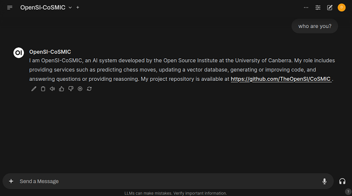
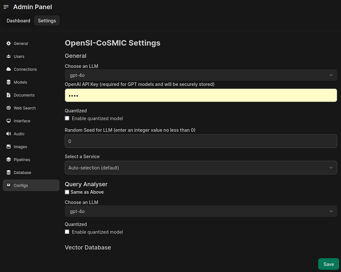

# OpenSI-CoSMIC - Cognitive System of Machine Intelligent Computing

[](https://opensource.org/licenses/MIT)
[](https://arxiv.org/abs/2408.04910)
[](https://www.python.org)
[](https://www.canberra.edu.au/about-uc/media/newsroom/2024/november/ucs-opensi-researchers-develop-framework-to-integrate-and-interpret-ai-tools)
[](https://www.docker.com/)

This is the official implementation of the Open Source Institute-Cognitive System of Machine Intelligent Computing (OpenSI-CoSMIC) v1.0.0.

## Installation

### Option 1: Docker Installation (Quick Start)
**Note:** Under development, please follow [Option 2](#option-2-clone-and-set-up-repository).

The Docker installation provides the fastest way to get started with OpenSI-CoSMIC:

1. Pull the latest CoSMIC image:

```bash
docker pull opensicbr/cosmic:demo
```

2. (Optional) Create an `.env` file to store your OpenAI API key if you plan to use OpenAI models:

```bash
echo "OPENAI_API_KEY='your_api_key'" > /path/to/save/.env
```

3. Run the container, [Open-WebUI](https://github.com/open-webui/open-webui) with CoSMIC pipeline will 
be available at port 8080:

```bash
bash docker_run.sh
```

4. (Optional) Compile the docker image, run
```bash
bash docker_compile.sh
```

**Note**: While the Docker setup offers a streamlined environment for testing, it grants direct access to 
the host network and is **not recommended for production environments**.

#### Requirements for Docker Installation
- [Docker](https://docs.docker.com/engine/install/) must be installed on your local machine.
```bash
apt install docker.io
```
- An OpenAI API key is optional (only required if you plan to use OpenAI models)

### Option 2: Clone and Set Up Repository
1. Download CoSMIC in a separate directory in your work directory:
```bash
# For users using SSH on GitHub
git clone --recursive git@github.com:TheOpenSI/CoSMIC.git

# For users using HTTPS
git clone --recursive https://github.com/TheOpenSI/CoSMIC.git
```

2. For chess-game queries, users need to [download](https://stockfishchess.org/download/linux/) the Stockfish binary file (stockfish-ubuntu-x86-64-avx2 for Linux) and store it at the default location: `third_party/stockfish/stockfish-ubuntu-x86-64-avx2`.
The path of this binary file can be customized in [config.yaml](scripts/configs/config.yaml):
```yaml
chess:
    stockfish_path: ""  # add the path in ""; otherwise, the default path will be used.
```

3. For code generation queries, users need to
  - Download the [PyCapsule](https://github.com/TheOpenSI/PyCapsule) service in a separate directory of your work directory.
This is the Python code generation service for CoSMIC.

```bash
git clone https://github.com/TheOpenSI/PyCapsule.git
cd PyCapsule
```

  - Run the `start_pc.sh` script to start the PyCapsule service.
```bash
bash start_pc.sh
```
**Note:** [Docker](https://docs.docker.com/engine/install/) is required for this service. See [requirements](#requirements-for-repository-installation) for more details.

By default, the LLM model for this service is set to `Qwen2.5-Coder-Instruct`, which is made available using the official Ollama docker image. 
The corresponding Ollama container serves at port `11434`. 
To change the service configuration, please follow the instructions in the [PyCapsule repository](https://github.com/TheOpenSI/PyCapsule).

#### Requirements for Repository Installation
Please install the following packages before using this code, which is also provided in requirements.txt.
Users need to register for a Hugging Face account (set **hf_token=[your token]** in .env) to download base LLMs and an OpenAI account (set **openai_token=[your token]** in .env) to use the API if applicable.

To use [Ollama models](https://ollama.com/library), in [config.yaml](scripts/configs/config.yaml) set the LLM name indexed by "ollama:" as **llm_name: ollama:[your ollama model name]**.
If an Ollama model has not yet been pulled to a local directory, it might take a few minutes, depending on the model size.

```
huggingface_hub==0.24.0
setuptools==75.1.0
chess==1.10.0
stockfish==3.28.0
bitsandbytes==0.43.1
faiss-cpu==1.8.0
imageio==2.34.2
llama_index==0.11.1
matplotlib==3.7.5
numpy==1.24.3
openai==1.42.0
pandas==2.0.3
peft==0.11.1
Pillow==10.4.0
python-dotenv==1.0.1
pytz==2024.1
torch==2.3.0
transformers==4.42.4
python-box==7.2.0
PyYAML==6.0.2
regex==2024.5.15
langchain==0.2.14
langchain_community==0.2.12
langchain_huggingface==0.0.3
ollama==0.4.7
httpx==0.27.2
uvicorn==0.33.0
fastapi==0.115.7
passlib==1.7.4
jwt==1.3.1
python-multipart==0.0.20
```

To use the [PyCapsule](modules/code_generation/code_generation.py) service, users need to install [Docker](https://docs.docker.com/engine/install/). Follow the instructions provided in the Docker documentation for your specific operating system.

## Framework
The system is configurated through [config.yaml](scripts/configs/config.yaml).
Currently, it has 5 base services, including

- [Chess-game next move predication and analyse](src/services/chess.py)
- [Vector database for text-based and document-base information update](src/services/vector_database.py)
- [Context retrieving through the vector database](src/services/rag.py) if applicable
- [PyCapsule (python code generation)](https://github.com/TheOpenSI/PyCapsule)
- [General question answering and reasoning](src/services/qa.py)

Each query will be parsed by [an LLM-based analyser](src/query_analyser/query_analyser.py) to select the most relevant service.

Upper-level chess-game services include

- [Puzzle next move prediction and analyse](src/modules/chess_qa_puzzle.py)
- [FEN generation given a sequence of moves](src/modules/chess_genfen.py)
- [Chain-of-Thought generation for next move prediction](src/modules/chess_gencot.py)


## Use on a Local Machine

### [Local User] Chatbot

We provide a website based chatbot for the interaction between user and OpenSI-CoSMIC.
The backend program is exected in a docker container.
To run the chatbot on a local machine, the user needs to compile the docker container first as below.
This is exected for once only.

**Note**: whenever this shell file is executed, the user registration information will be cleaned, requiring a new registration of an admin user, followed by general users.
This is restricted by [Open-WebUI](https://github.com/open-webui/open-webui).
```bash
touch .env   # then if OpenAI GPT API is used, please add OPENAI_API_KEY="[your API key]" in .env.
bash local_compile.sh  # This is executed once only to reserve the user registration information.
```

Then, to enable CoSMIC pipeline, the user needs to start the pipeline as below so that the chatbot can detect the pipeline.
```bash
bash local_run.sh
```

[](assets/chatbot_ui.png)

with **the configuration settings** in

[](assets/chatbot_setting.png)

This chatbot is developed on the open-source [Open-WebUI](https://github.com/open-webui/open-webui) under the MIT license.

### [Local User] Development

The default LLMs for QA and query analyser are "gpt-4o" while one can change them in [config.yaml](scripts/configs/config.yaml).
The full list of supported LLMs is provided in [LLM_MODEL_DICT](src/maps.py).

- We demonstrate the use of OpenSI-CoSMIC below.
    ```python
    # Quit by entering quit or exit.
    python demo.py
    ```

- Alternatively, one can use the following development instruction.
    ```python
    from src.opensi_cosmic import OpenSICoSMIC
    from utils.log_tool import set_color

    # Build the system with a config file, which contains LLM name, or a given base LLM name.
    use_config_file = True

    if use_config_file:
        config_path = "scripts/configs/config.yaml"
        opensi_cosmic = OpenSICoSMIC(config_path=config_path)
    else:
        llm_name = "mistral-7b-instruct-v0.1"
        opensi_cosmic = OpenSICoSMIC(llm_name=llm_name)

    # Set the question.
    # One can set each question with "[question],[reference answer (optional)]" in a .csv file.
    query = "What is the capital of Australia?"

    # Get the answer, raw_answer for response without truncation, retrieve_score (if switched on) for
    # the similarity score to context in the system's vector database.
    answer, raw_answer, retrieve_score = opensi_cosmic(query, log_file=None)

    # Print the answer.
    print(set_color("info", f"Question: {query}\nAnswer: {answer}."))

    # Remove memory cached in the system.
    opensi_cosmic.quit()
    ```
    More example questions are provided in [test.csv](data/test.csv), which can be used as
    ```python
    import os, csv
    import pandas as pd

    from src.opensi_cosmic import OpenSICoSMIC
    from utils.log_tool import set_color

    # Build the system with a given base LLM.
    llm_name = "mistral-7b-instruct-v0.1"
    opensi_cosmic = OpenSICoSMIC(llm_name=llm_name)

    # Get the file's absolute path.
    current_dir = os.path.dirname(os.path.abspath(__file__))
    root = f"{current_dir}"

    # Set a bunch of questions, can also read from .csv.
    df = pd.read_csv(f"{root}/data/test.csv")
    queries = df["Question"]
    answers = df["Answer"]

    # Loop over questions to get the answers.
    for idx, (query, gt) in enumerate(zip(queries, answers)):
        # Skip marked questions.
        if query.find("skip") > -1: continue

        # Create a log file.
        if query.find(".csv") > -1:
            # Remove all namespace.
            query = query.replace(" ", "")

            # Return if file is invalid.
            if not os.path.exists(query):
                set_color("error", f"!!! Error, {query} not exist.")
                continue

            # Change the data folder to results for log file.
            log_file = query.replace("/data/", f"/results/{llm_name}/")

            # Create a folder to store log file.
            log_file_name = log_file.split("/")[-1]
            log_dir = log_file.replace(log_file_name, "")
            os.makedirs(log_dir, exist_ok=True)
            log_file_pt = open(log_file, "w")
            log_file = csv.writer(log_file_pt)
        else:
            log_file_pt = None
            log_file = None

        # Run for each question/query, return the truncated response if applicable.
        answer, _, _ = opensi_cosmic(query, log_file=log_file)

        # Print the answer.
        if isinstance(gt, str):  # compare with GT string
            # Assign to q variables.
            status = "success" if (answer.find(gt) > -1) else "fail"

            print(set_color(
                status,
                f"\nQuestion: '{query}' with GT: {gt}.\nAnswer: '{answer}'.\n")
            )

        # Close log file pointer.
        if log_file_pt is not None:
            log_file_pt.close()
        
    # Remove memory cached in the system.
    opensi_cosmic.quit()
    ```

## Access Statistic
For Chatbot users, the user access information including the user ID, email, visit dates, average token length, and the number of queries are stored monthly.
- For local users: data/cosmic/statistic/[month]-[year].csv on the local machine.
- For docker image users: /app/data/cosmic/statistic/[month]-[year].csv in the cosmic container.

## Reference
If this repository is useful for you, please cite the paper below.
```bibtex
@misc{Adnan2024,
    title         = {Unleashing Artificial Cognition: Integrating Multiple AI Systems},
    author        = {Muntasir Adnan and Buddhi Gamage and Zhiwei Xu and Damith Herath and Carlos C. N. Kuhn},
    howpublished  = {Australasian Conference on Information Systems},
    year          = {2024}
}
```

## Contact
For technical supports, please contact [Danny Xu](mailto:danny.xu@canberra.edu.au) or [Muntasir Adnan](mailto:adnan.adnan@canberra.edu.au).
For project supports, please contact [Carlos C. N. Kuhn](mailto:carlos.noschangkuhn@canberra.edu.au).

## Contributing

We welcome contributions from the community! Whether you’re a researcher, developer, or enthusiast, there are many ways to get involved:

 - Report Issues: Found a bug or have a feature request? Open an issue on our GitHub page.
 - Submit Pull Requests: Contribute code by submitting pull requests. Please follow [our contribution guidelines](CONTRIBUTING.md).
 - Make a Donation: Support our project by making a donation [here](https://payments.canberra.edu.au/Misc/tran?tran-type=OPENSI).

## License
This code is distributed under [the MIT license](LICENSE).
If Mistral 7B v0.1, Mistral 7B Instruct v0.1, Gemma 7B, or Gemma 7B It from Hugging Face is used, please also follow the license of Hugging Face;
if the API of GPT 3.5-Turbo or GPT 4-o from OpenAI is used, please also follow the licence of OpenAI.

## Funding
This project is funded under the agreement with the ACT Government for Future Jobs Fund with Open Source Institute (OpenSI)-R01553 and NetApp Technology Alliance Agreement with OpenSI-R01657.